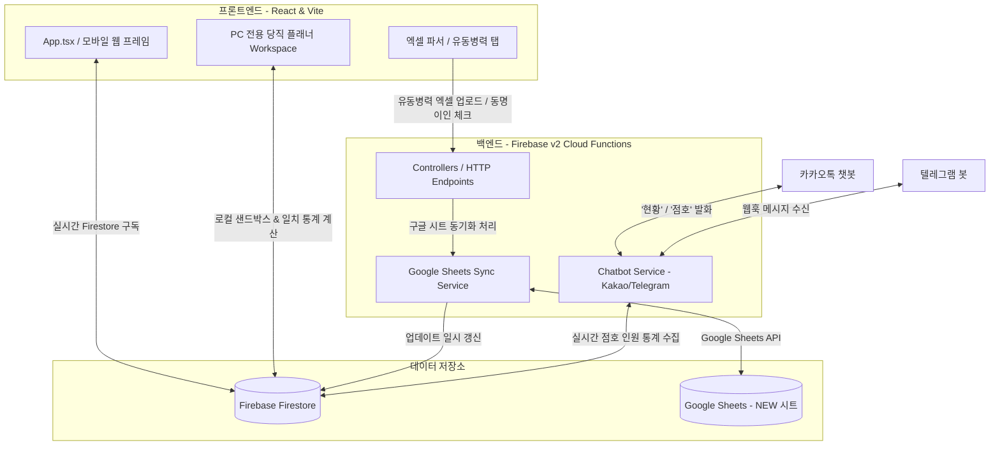

# 🎖️ NCOA (Non-Commissioned Officers Association) Management System

**NCOA Management System**은 KATUSA 및 대한민국 육군 부대 내에서 대원들의 **점호(Roll Call), 당직(Duty Plan), 유동병력(Movement Registry), 신상 정보(Personnel Directory)**를 효율적으로 관리하고 자동화하기 위해 설계된 통합 관리 솔루션입니다. 

Vite + React 19 기반의 반응형 프론트엔드와 Firebase Cloud Functions V2 + Firestore + Google Sheets API가 융합된 고도화된 서버리스 아키텍처를 특징으로 합니다. 모바일에 최적화된 메인 앱 레이아웃과 더불어, 데스크톱 PC 전용의 프리미엄 드래그 앤 드롭(DnD) 당직 플래너 작업 공간(Workspace)을 분리 제공합니다.

---

## 🏗️ 시스템 아키텍처 및 데이터 흐름

이 시스템은 클라이언트 브라우저 상에서 엑셀(Excel/CSV) 파일 분석 및 드래그 앤 드롭을 직접 처리하고, 데이터 정합성이 중요한 동기화나 외부 메신저 봇과의 연동은 Firebase Cloud Functions 백엔드를 통해 안전하게 수행합니다.



---

## 🛠️ 기술 스택 (Tech Stack)

### 프론트엔드 (Frontend)
- **Core Library:** React 19 (TypeScript 데코레이션 가미)
- **Build Tool:** Vite 7.x
- **Styling:** Tailwind CSS v3 & PostCSS (반응형 모바일 프레임 레이아웃)
- **State Management:** 리액티브 Custom Hooks 기반의 Firestore 단방향 데이터 바인딩
- **Interactive UI & Animations:** 
  - `@dnd-kit/core`: 캘린더 드래그 앤 드롭 당직 배정
  - `framer-motion`: 프리미엄 마이크로 인터랙션 및 프레임 전환 효과
  - `lucide-react`: 모던 벡터 아이콘 팩
- **Data Parsers:**
  - `xlsx` (SheetJS): 엑셀 유동병력 데이터 파싱 및 가공
  - `papaparse`: CSV 파일 파싱 및 로컬 가공

### 백엔드 (Backend)
- **Serverless Framework:** Firebase Functions (v2 HTTPS Runtime)
- **Runtime:** Node.js 24 (ESModule 기반 TypeScript 6)
- **Database:** Firebase Firestore (실시간 온스냅샷 동기화)
- **Third-Party APIs:**
  - `googleapis` (v171): Google Spreadsheets API 연동
  - `axios` (v1): 카카오톡 및 텔레그램 오픈 API 통신 및 웹훅 연동

---

## 📂 디렉토리 구조 및 역할 분담 (Directory Structure)

본 프로젝트는 최적의 관리 유연성을 위해 **프론트엔드(FE)**와 **백엔드(BE)** 코드가 철저히 물리적으로 분리되어 설계되었습니다.

### 1. 💻 프론트엔드 영역 (`src/` 및 설정 파일)
```bash
src/
├── assets/                  # 이미지, 로고 등 정적 자원
├── components/              # 재사용 가능한 UI 컴포넌트 모음
│   ├── calendar/            # 점호/스케줄 캘린더 전용 서브 컴포넌트 (DnD, Modal, Header 등)
│   ├── duty/                # PC 전용 당직 스케줄러 컴포넌트 (Sidebar, Grid, Workspace 등)
│   ├── movement/            # 엑셀 파일 로딩, 동명이인 수동 매칭 모달, 시트뷰
│   ├── personnel/           # 대원 신상 정보 상세 및 추가/수정 양식 폼 모달
│   ├── rollcall/            # 실시간 점호 통계, 카카오 알림톡 템플릿 복사, 수동 인원 지정
│   ├── tabs/                # 메인 탭 컴포넌트 (RollCall, Calendar, Movement, Personnel)
│   └── BottomNav.tsx        # 메인 하단 모바일 내비게이션 바
├── hooks/                   # 비즈니스 로직과 UI가 격리된 커스텀 훅 모음
│   ├── calendar/            # 일정 스케줄 구독, 시트 동기화, KTA/BLC 템플릿 훅
│   ├── duty/                # 당직 배정 샌드박스, 횟수 통계 세분화 훅
│   ├── member/              # 대원명단 실시간 실시간 구독(Subscription) 훅
│   ├── movement/            # 유동병력 상태 관리 및 API 통신 훅
│   └── rollcall/            # 점호 참여도 및 스케줄 파서 연동 훅
├── lib/                     # Firebase 클라이언트 모듈 인스턴스화 및 헬퍼 유틸
├── types/                   # 캘린더, 대원, 점호에 대한 전역 TypeScript 인터페이스
└── utils/                   # 점호 파싱 및 캘린더 그리드 시간 계산 헬퍼 함수
```

### 2. ⚙️ 백엔드 영역 (`functions/` 및 설정 파일)
```bash
functions/src/
├── config/                  # Firebase 관리자 SDK 구성 및 CORS 프리플라이트 핸들러
├── controllers/             # 외부에서 호출 가능한 HTTPS Endpoint 컨트롤러
│   ├── chatbot.controller.ts   # 카카오톡 챗봇 API 요청 및 텔레그램 웹훅 통신 제어
│   ├── rollCall.controller.ts  # 특정 날짜 점호 종합 데이터(아침/저녁 점호 양식) 생성
│   └── sheet.controller.ts     # 구글 스프레드시트 갱신 트리거 및 알림
├── repositories/            # Firestore 컬렉션 및 구글 시트에 직접 접근하는 데이터 레이어
├── services/                # 구글 시트 동기화 비즈니스 로직 및 카카오/텔레그램 봇 처리 엔진
│   ├── kakao.service.ts        # 카카오톡에 맞춤 포맷된 실시간 점호 통계 메시지 생성
│   ├── rollCall.service.ts     # 아침/저녁 점호 대상자(열외, 회복, 복귀, 잔류) 분류 코어 서비스
│   ├── sheetSync.service.ts    # 유동병력 데이터 스프레드시트(A1 주소 자동 계산) 동기화
│   └── telegram.service.ts     # 텔레그램 채팅방 명령어 파싱 및 수동 알림
└── utils/                   # 서버측 시간 변환(KST), 계급 한글 표기, A1 Address 계산 유틸
```

---

## 🌟 핵심 기능 정의 (Feature Deep Dive)

### 1. 📱 반응형 스마트 점호 관리 (`RollCallTab.tsx` / `rollCall.service.ts`)
- **점호 자동 입력 및 서식 변환:**
  - 내일 날짜가 평일인 경우 아침 체력 단련 스케줄(`0620 HQ PT`)을 자동 생성합니다.
  - **KTA(카투사 교육대) 및 BLC(부사관 교육대) 연동:** 각 기수별 `Day 0`(입교일) 및 날짜별 템플릿 일정을 구독하여, 날짜 경과 일수를 역계산하여 해당일의 교과목/상태 스케줄을 점호 텍스트에 자동 주입합니다.
- **모바일 원클릭 점호 양식 복사:** 아침 점호 및 저녁 점호 전용 통계 서식(열외 현황, 잔류 현황, 사고자 명단 등)을 자동으로 생성하여 메신저 전송용 복사 기능을 제공합니다.

### 2. 🖥️ PC 전용 당직 배정 작업장 (`DutySchedulerWorkspace.tsx` / `useDutyState.ts`)
- **실시간 로컬 샌드박스:** 
  - 실제 데이터베이스를 훼손하지 않고 화면상에서 자유롭게 당직 대원을 배정하고 조율해볼 수 있는 안전한 샌드박스 상태를 제공합니다.
- **근무 가중치 통계 계산:**
  - 대원별 당월 근무 횟수를 **평당(평일 당직), 금일당(금/일요일 당직), 토당(토요일 당직)**으로 삼차원 정밀 분류하여 밸런스 있는 근무 배정을 보장합니다.
- **근무 제한 브러시:** KTA 복무 대원, 의무병(Medic), 작전병(S3) 등의 고유 보직 제한 및 대원별 불가 날짜(Personal Restriction)를 캘린더에 색상 브러시 형태로 시각화하여 근무 배정 실수를 방지합니다.

### 3. 📂 엑셀 유동병력 시트 실시간 동기화 (`MovementTab.tsx` / `sheetSync.service.ts`)
- **구글 스프레드시트 실시간 양방향 매핑:** 
  - 부대에서 공용으로 사용하는 Google Sheets(NEW 시트)의 A1 데이터 레이아웃에 직접 접근하여 휴가출발, 복귀, 외출/외박 처리를 즉각 동기화합니다.
- **동명이인 및 모호한 성명 예외 처리 (Ambiguity Resolution):**
  - 업로드된 엑셀 성명이 구글 시트상의 표기와 정밀 일치하지 않는 경우(예: 성만 표기되거나 계급이 다른 경우) 백엔드에서 `status: "ambiguous"`를 반환합니다.
  - 프론트엔드는 사용자에게 수동 매칭 모달(`movement.ambiguous-modal.component.tsx`)을 띄워, 정확한 대원을 직접 선택할 수 있는 휴먼 인터벤션 인터페이스를 제공합니다.

### 4. 💬 외부 메신저 알림이 챗봇 (`kakaoBot` / `telegramBot`)
- **카카오톡 챗봇 연동:** 카카오톡 발화 `"현황"` 또는 `"점호"` 분석을 감지하여 현재 복무 대원의 휴가/외출/당직 열외 현황 통계를 전송합니다.
- **텔레그램 알림 봇 연동:** 서버리스 웹훅 엔드포인트를 통해 실시간 부대 통계 명령어를 텔레그램 채팅 인터페이스로 양방향 전송합니다.

---

## 🚀 시작하기 및 배포 가이드 (Quick Start & Deployment)

### 1. 개발 환경 요구사항
- Node.js v24 이상
- Firebase CLI (`npm install -g firebase-tools`)
- Google Cloud Platform 계정 (구글 시트 연동을 위한 GCP 서비스 계정 키 파일 필요)

### 2. 로컬 실행

#### 프론트엔드 (Vite Server)
```bash
# 루트 디렉토리에서 패키지 설치
npm install

# 로컬 개발 서버 구동 (localhost:5173)
npm run dev
```

#### 백엔드 (Firebase Functions)
```bash
# functions 디렉토리로 이동하여 설정 설치
cd functions
npm install

# 로컬 에뮬레이터를 이용한 백엔드 구동
npm run serve
```

### 3. 프로젝트 빌드 및 배포

#### 프론트엔드 빌드 (Firebase Hosting)
```bash
# 프로덕션 번들 빌드
npm run build

# 빌드 결과물(dist/)을 Firebase 호스팅으로 단독 배포
firebase deploy --only hosting
```

#### 백엔드 배포 (Cloud Functions)
```bash
# TypeScript 빌드 및 Cloud Functions 배포
cd functions
npm run deploy
```

---

🎖️ **NCOA Management System**은 최상의 부대 보안 및 철저한 대원 프라이버시 보호를 준수하며, 운영상의 인적 실수를 제로로 만들기 위해 설계되었습니다.
