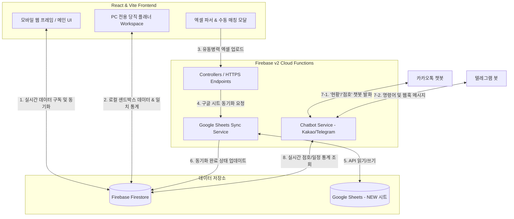

# 🎖️ NCOA (Non-Commissioned Officers Association) Management System

**NCOA Management System**은 KATUSA 및 대한민국 육군 부대 내에서 대원들의 **점호(Roll Call), 당직(Duty Plan), 유동병력(Movement Registry), 신상 정보(Personnel Directory)**를 효율적으로 관리하고 자동화하기 위해 설계된 통합 관리 솔루션입니다. 

Vite + React 19 기반의 반응형 프론트엔드와 Firebase Cloud Functions V2 + Firestore + Google Sheets API가 융합된 고도화된 서버리스 아키텍처를 특징으로 합니다. 모바일에 최적화된 메인 앱 레이아웃과 더불어, 데스크톱 PC 전용의 프리미엄 드래그 앤 드롭(DnD) 당직 플래너 작업 공간(Workspace)을 제공합니다.

---

## 🏗️ 시스템 아키텍처 및 데이터 흐름

이 시스템은 클라이언트 브라우저 상에서 엑셀(Excel/CSV) 파일 분석 및 드래그 앤 드롭을 직접 처리하고, 데이터 정합성이 중요한 동기화나 외부 메신저 봇과의 연동은 Firebase Cloud Functions 백엔드를 통해 안전하게 수행합니다.

### 데이터 흐름도 (Data Flow Diagram)



### 상세 데이터 흐름 및 상호작용 설명

1. **실시간 Firestore 동기화:** 
   - 프론트엔드는 Firestore의 데이터를 실시간(onSnapshot)으로 구독하여 대원 상태, 일정, 당직 정보를 항상 실시간으로 갱신합니다.
2. **로컬 샌드박스 당직 배정:**
   - 당직 플래너 사용 시 대원 배정 상태를 즉시 저장하지 않고 로컬 상태에서 가상으로 당직을 시뮬레이션하고 통계를 계산합니다. 최종 저장 버튼을 누를 때만 Firestore로 벌크 업데이트가 수행됩니다.
3. **유동병력 엑셀 가공 및 동기화:**
   - 관리자가 부대 내 유동병력 엑셀 파일을 업로드하면 브라우저 내에서 데이터를 파싱하고 Firestore 내 대원 명단과 일치 여부를 대조합니다.
   - 이름이 불완전하거나 동명이인이 존재할 경우, 사용자에게 수동 매칭 인터페이스를 제공해 모호성을 해결(Ambiguity Resolution)합니다.
   - 매칭된 데이터는 백엔드를 거쳐 Google Sheets API를 통해 공용 구글 스프레드시트의 해당 주소 영역에 정교하게 동기화됩니다.
4. **챗봇 정보 수집 및 발송:**
   - 카카오톡 및 텔레그램 봇으로부터의 메시지가 Firebase Cloud Functions의 챗봇 엔드포인트에 도달하면, 당일의 점호 데이터 및 유동병력 통계를 Firestore에서 쿼리하여 지정된 포맷의 텍스트로 사용자에게 전송합니다.

---

## 💻 웹앱 상세 사용 방법 (Usage Guide)

NCOA Management System은 모바일에 최적화된 **4개의 메인 탭**과 PC 화면에 최적화된 **당직 스케줄러 워크스페이스**로 구성되어 있습니다.

---

### 1. 📱 스마트 점호 관리 (Roll Call Tab)

부대원들의 아침/저녁 점호 인원 현황을 파악하고, 카카오톡/텔레그램 등의 메신저에 바로 공유할 수 있는 점호 보고 텍스트 양식을 자동으로 생성합니다.

*   **기본 날짜 설정 및 새로고침:** 
    *   상단의 날짜 선택기를 클릭하여 원하는 점호 날짜를 지정합니다. 
    *   새로고침 버튼을 누르면 당일 유동병력 정보와 대원 정보가 Firestore 및 구글 스프레드시트로부터 최신화됩니다.
*   **스마트 일정 파싱 및 스케줄 텍스트 연동:**
    *   화면 중앙의 스케줄 텍스트 영역에 당일 일정(예: `0620 HQ PT`, `0900 외출`)을 기입할 수 있습니다. 
    *   **정렬 기능:** "시간 정렬" 버튼을 누르면 입력한 텍스트가 시간순(0620, 0900 등)으로 자동 재정렬됩니다.
*   **KTA & BLC 일정 자동 역계산:**
    *   KTA(카투사 교육대) 또는 BLC(미 부사관 학교) 파견 중인 대원이 존재할 경우, 기수별 입교일(`Day 0`)을 기반으로 현재 해당 대원이 며칠 차(`Day 1`, `Day 2` 등)인지 역계산하여 당일 교과목이나 훈련 일정을 스케줄에 자동으로 추가해 줍니다.
*   **건강 특이사항 및 명단 편집:**
    *   건강 특이사항(Sick Call, 프로필 등) 및 내일 주요 일정을 입력 상자에 작성합니다.
    *   **수동 카테고리 지정:** 아침 점호 인원 중 열외/잔류/복귀 등 특정 상태의 대원을 수동으로 지정하고 싶다면 대원 리스트 옆의 토글 버튼을 통해 카테고리를 간편하게 변경할 수 있습니다.
*   **점호 양식 원클릭 복사:**
    *   작성이 완료되면 **"아침 점호 양식 복사"** 또는 **"저녁 점호 양식 복사"** 버튼을 눌러 서식이 완성된 보고 문구를 클립보드에 복사할 수 있습니다.

---

### 2. 📅 일정 및 점호 캘린더 (Calendar Tab)

월간 단위의 군부대 일정 및 당직 스케줄을 한눈에 조회하고 수정하는 종합 일정 관리 도구입니다.

*   **일정 모드 vs 당직 모드 스위치:**
    *   캘린더 상단 우측의 토글 버튼을 통해 일반 군부대 일정(`schedule` 모드)과 당직 근무 정보(`duty` 모드)를 전환하여 확인할 수 있습니다.
*   **개별 일정 및 당직 추가:**
    *   캘린더의 특정 날짜 셀을 클릭하면 모달 팝업이 활성화됩니다.
    *   **일정 모드:** 일정 제목, 기간(시작/종료일)을 입력해 부대 공휴일, 외출, 훈련 일정을 추가할 수 있습니다.
    *   **당직 모드:** 해당 날짜의 당직 근무자(사관, 부사관 등)를 드롭다운을 통해 직접 배정합니다.
*   **일괄 당직 근무 등록 (Batch Duty Modal):**
    *   "일괄 당직 등록" 기능을 통해 여러 날짜의 당직 근무자를 시트 형식으로 한 번에 신속하게 배정하고 저장할 수 있습니다.
*   **KTA / BLC 교육 템플릿 드래그 앤 드롭:**
    *   설정 메뉴 내에서 KTA 및 BLC 템플릿 관리 창을 열 수 있습니다.
    *   각 기수의 날짜별 상세 교육 일정을 마우스 드래그 앤 드롭으로 재배치하고 편집하여 템플릿화해 둘 수 있습니다.
*   **당직 이력 트래커 (Duty Tracker):**
    *   "당직 트래커" 버튼을 클릭하여 특정 대원이 최근에 언제 근무를 섰는지, 최근 근무 이력과 일자별 배정 횟수를 정밀 모니터링하여 공평한 근무가 이루어지도록 돕습니다.

---

### 3. 📂 유동병력 관리 및 구글 시트 동기화 (Movement Tab)

부대 외부로 나간 병력(휴가, 외출, 외박, 병가 등)의 데이터가 기재된 엑셀/CSV 파일을 읽어와 데이터베이스 및 공용 구글 스프레드시트에 안전하게 반영합니다.

*   **구글 시트 뷰 모드 (`sheet`):**
    *   구글 스프레드시트의 주간 유동병력 현황을 웹 화면에 테이블 형태로 직접 표시합니다.
    *   주차별 이동 버튼(`이전 주` / `다음 주`)을 사용하여 과거나 미래의 유동병력 배치 현황을 바로 조회할 수 있습니다.
*   **엑셀 업로드 및 동기화 프로세스:**
    *   행정계통이나 국방망에서 다운로드한 유동병력 현황 엑셀 파일을 가져와 드래그 앤 드롭하거나 파일 선택기로 업로드합니다.
    *   업로드된 엑셀 내부의 대원 성명, 유동 구분(휴가, 외박 등), 기간 정보를 브라우저 내에서 가공해 예비 타임라인 화면으로 보여줍니다.
    *   "구글 시트 동기화" 버튼을 클릭하여 백엔드(Firebase Functions)를 거쳐 구글 스프레드시트에 직접 동기화합니다.
*   **동명이인 및 미등록 대원 매칭 모달:**
    *   엑셀 업로드 중 이름만 적혀 있어 특정하기 힘든 대원(예: `김민수`가 부대에 2명인 경우)이나 오타로 인해 미등록된 상태가 발견되면, 자동으로 **"동명이인 / 미매칭 대원 확인" 모달**이 나타납니다.
    *   사용자는 모달 창에 나타난 후보 대원들 중 실제 대상자가 누구인지 수동으로 라디오 버튼을 선택하여 정확하게 매칭시킨 뒤 동기화를 완료할 수 있습니다.

---

### 4. 👥 신상 정보 관리 (Personnel Tab)

부대에 소속된 대원(KATUSA 및 대한민국 육군)과 연동된 미군 러너(Runner)들의 인적 사항을 관리합니다.

*   **부대원 정보 실시간 확인:**
    *   현재 복무 중인 대원들의 목록을 보여주며, 전입 예정 대원은 "전입 예정" 태그와 함께 비활성화(흐릿하게) 표시됩니다.
*   **계급 자동 계산 시스템:**
    *   대원의 입대일(Enlistment Date)과 현재 날짜를 기반으로 **계급(이병/일병/상병/병장)이 자동으로 계산**되어 표기됩니다.
    *   **조기진급 처리:** 만약 조기진급을 한 대원의 경우 "조기진급 개월 수"를 입력해 두면, 자동 계급 계산 공식에 가산되어 올바른 계급이 계산됩니다.
*   **대원 추가 및 정보 수정:**
    *   우측 상단의 "대원 추가" 버튼을 통해 성명, 군번, 입대일, 전출일, 보직(섹션), 소속 등의 상세 인적 사항을 입력하여 새 대원을 등록합니다.
    *   대원 목록에서 특정 대원을 클릭하면 상세 신상 정보 모달이 열려 정보 편집 및 삭제가 가능합니다.
*   **미군 러너(Runner) 등록 및 관리:**
    *   군부대 특성상 함께 훈련받는 미군 카운터파트 대원(러너)들을 하단 영역에 분리 관리하여 추가 및 삭제를 지원합니다.

---

### 5. 🖥️ PC 전용 당직 배정 작업장 (Duty Scheduler Workspace)

*데스크톱 PC 환경에서만 진입이 가능한 특화된 대형 스케줄링 화면입니다.*

*   **로컬 샌드박스 배정 및 실시간 드래그 앤 드롭:**
    *   좌측 사이드바에 표시되는 대원 카드들을 우측의 캘린더 날짜 셀 위로 **마우스 드래그 앤 드롭(DnD)**하여 즉각 배정할 수 있습니다.
    *   화면상에서 근무를 바꾸거나 임시로 배정해 보아도 실제 DB에는 즉시 영향을 주지 않으므로 안심하고 근무를 조율할 수 있습니다. 조율 완료 후 상단의 "저장"을 클릭하면 최종 반영됩니다.
*   **삼차원 근무 가중치 실시간 계산 (Weight Counter):**
    *   사이드바의 대원 목록 옆에는 각 대원이 이번 달에 서게 되는 당직 횟수가 실시간으로 집계됩니다.
    *   **평당(평일 당직)**, **금일당(금요일/일요일 당직)**, **토당(토요일 당직)**으로 세분화되어 카운트되므로 특정인에게 주말 당직이 쏠리지 않도록 공평한 근무 분배를 보장합니다.
*   **시각적 근무 제한 브러시 (Restriction Brush):**
    *   특정 보직(예: Medic, S3 등)이나 개별적으로 지정한 근무 불가 날짜(Personal Restriction)가 있는 대원을 드래그하려고 하면, 해당 대원이 들어갈 수 없는 날짜 셀이 빨간색이나 노란색 빗금 브러시로 활성화되어 배정 실수를 직관적으로 방지해 줍니다.

---

## 🛠️ 기술 스택 (Tech Stack)

### 프론트엔드 (Frontend)
- **Core Library:** React 19 (TypeScript 데코레이션 가미)
- **Build Tool:** Vite 7.x
- **Styling:** Tailwind CSS v3 & PostCSS (반응형 모바일 프레임 레이아웃)
- **State Management:** 리액티브 Custom Hooks 기반의 Firestore 단방향 데이터 바인딩
- **Interactive UI & Animations:** 
  - `@dnd-kit/core`: 캘린더 드래그 앤 드롭 당직 배정
  - `framer-motion`: 프리미엄 마이크로 인터랙션 및 프레임 전환 효과
  - `lucide-react`: 모던 벡터 아이콘 팩
- **Data Parsers:**
  - `xlsx` (SheetJS): 엑셀 유동병력 데이터 파싱 및 가공
  - `papaparse`: CSV 파일 파싱 및 로컬 가공

### 백엔드 (Backend)
- **Serverless Framework:** Firebase Functions (v2 HTTPS Runtime)
- **Runtime:** Node.js 24 (ESModule 기반 TypeScript 6)
- **Database:** Firebase Firestore (실시간 온스냅샷 동기화)
- **Third-Party APIs:**
  - `googleapis` (v171): Google Spreadsheets API 연동
  - `axios` (v1): 카카오톡 및 텔레그램 오픈 API 통신 및 웹훅 연동

---

## 📂 디렉토리 구조 및 역할 분담 (Directory Structure)

본 프로젝트는 최적의 관리 유연성을 위해 **프론트엔드(FE)**와 **백엔드(BE)** 코드가 철저히 물리적으로 분리되어 설계되었습니다.

### 1. 💻 프론트엔드 영역 (`src/` 및 설정 파일)
```bash
src/
├── assets/                  # 이미지, 로고 등 정적 자원
├── components/              # 재사용 가능한 UI 컴포넌트 모음
│   ├── calendar/            # 점호/스케줄 캘린더 전용 서브 컴포넌트 (DnD, Modal, Header 등)
│   ├── duty/                # PC 전용 당직 스케줄러 컴포넌트 (Sidebar, Grid, Workspace 등)
│   ├── movement/            # 엑셀 파일 로딩, 동명이인 수동 매칭 모달, 시트뷰
│   ├── personnel/           # 대원 신상 정보 상세 및 추가/수정 양식 폼 모달
│   ├── rollcall/            # 실시간 점호 통계, 카카오 알림톡 템플릿 복사, 수동 인원 지정
│   ├── tabs/                # 메인 탭 컴포넌트 (RollCall, Calendar, Movement, Personnel)
│   └── BottomNav.tsx        # 메인 하단 모바일 내비게이션 바
├── hooks/                   # 비즈니스 로직과 UI가 격리된 커스텀 훅 모음
│   ├── calendar/            # 일정 스케줄 구독, 시트 동기화, KTA/BLC 템플릿 훅
│   ├── duty/                # 당직 배정 샌드박스, 횟수 통계 세분화 훅
│   ├── member/              # 대원명단 실시간 실시간 구독(Subscription) 훅
│   ├── movement/            # 유동병력 상태 관리 및 API 통신 훅
│   └── rollcall/            # 점호 참여도 및 스케줄 파서 연동 훅
├── lib/                     # Firebase 클라이언트 모듈 인스턴스화 및 헬퍼 유틸
├── types/                   # 캘린더, 대원, 점호에 대한 전역 TypeScript 인터페이스
├── utils/                   # 점호 파싱 및 캘린더 그리드 시간 계산 헬퍼 함수
└── utils/                   # 시간 변환, 포맷팅 헬퍼 유틸리티
```

### 2. ⚙️ 백엔드 영역 (`functions/` 및 설정 파일)
```bash
functions/src/
├── config/                  # Firebase 관리자 SDK 구성 및 CORS 프리플라이트 핸들러
├── controllers/             # 외부에서 호출 가능한 HTTPS Endpoint 컨트롤러
│   ├── chatbot.controller.ts   # 카카오톡 챗봇 API 요청 및 텔레그램 웹훅 통신 제어
│   ├── rollCall.controller.ts  # 특정 날짜 점호 종합 데이터(아침/저녁 점호 양식) 생성
│   └── sheet.controller.ts     # 구글 스프레드시트 갱신 트리거 및 알림
├── repositories/            # Firestore 컬렉션 및 구글 시트에 직접 접근하는 데이터 레이어
├── services/                # 구글 시트 동기화 비즈니스 로직 및 카카오/텔레그램 봇 처리 엔진
│   ├── kakao.service.ts        # 카카오톡에 맞춤 포맷된 실시간 점호 통계 메시지 생성
│   ├── rollCall.service.ts     # 아침/저녁 점호 대상자(열외, 회복, 복귀, 잔류) 분류 코어 서비스
│   ├── sheetSync.service.ts    # 유동병력 데이터 스프레드시트(A1 주소 자동 계산) 동기화
│   └── telegram.service.ts     # 텔레그램 채팅방 명령어 파싱 및 수동 알림
└── utils/                   # 서버측 시간 변환(KST), 계급 한글 표기, A1 Address 계산 유틸
```

---

## 🚀 시작하기 및 배포 가이드 (Quick Start & Deployment)

### 1. 개발 환경 요구사항
- Node.js v24 이상
- Firebase CLI (`npm install -g firebase-tools`)
- Google Cloud Platform 계정 (구글 시트 연동을 위한 GCP 서비스 계정 키 파일 필요)

### 2. 로컬 실행

#### 프론트엔드 (Vite Server)
```bash
# 루트 디렉토리에서 패키지 설치
npm install

# 로컬 개발 서버 구동 (localhost:5173)
npm run dev
```

#### 백엔드 (Firebase Functions)
```bash
# functions 디렉토리로 이동하여 설정 설치
cd functions
npm install

# 로컬 에뮬레이터를 이용한 백엔드 구동
npm run serve
```

### 3. 프로젝트 빌드 및 배포

#### 프론트엔드 빌드 (Firebase Hosting)
```bash
# 프로덕션 번들 빌드
npm run build

# 빌드 결과물(dist/)을 Firebase 호스팅으로 단독 배포
firebase deploy --only hosting
```

#### 백엔드 배포 (Cloud Functions)
```bash
# TypeScript 빌드 및 Cloud Functions 배포
cd functions
npm run deploy
```

---

🎖️ **NCOA Management System**은 최상의 부대 보안 및 철저한 대원 프라이버시 보호를 준수하며, 운영상의 인적 실수를 제로로 만들기 위해 설계되었습니다.
